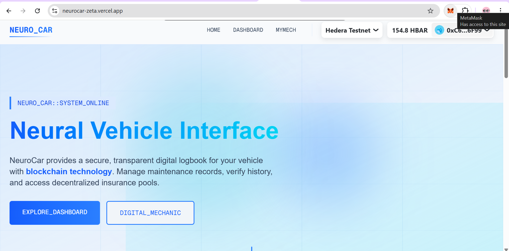
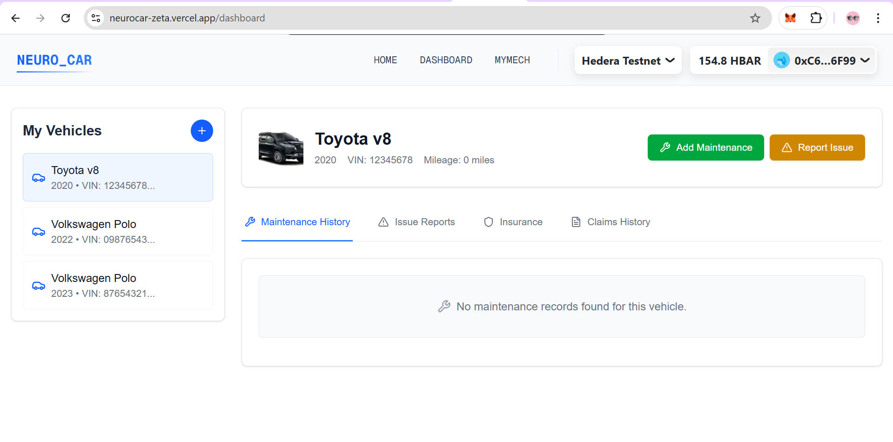
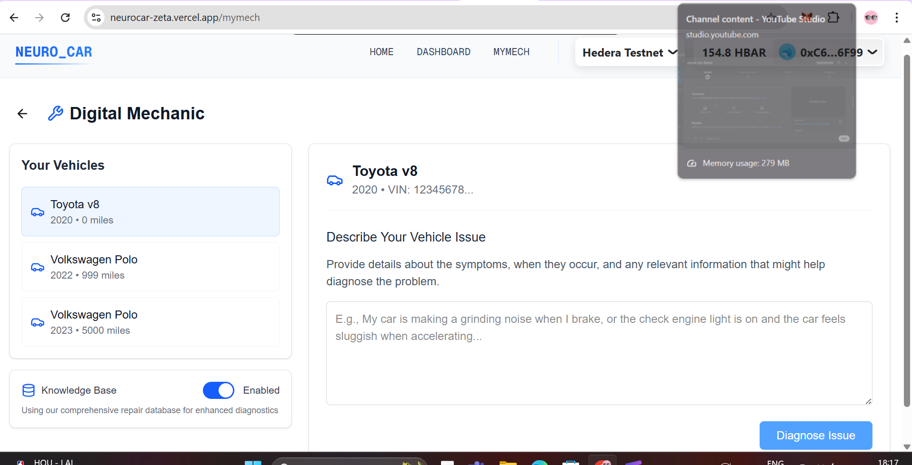

# NeuroCar

NeuroCar is a cutting-edge platform that leverages blockchain technology to revolutionize vehicle ownership, management, and insurance. By combining the power of decentralized systems with advanced smart contracts, NeuroCar provides a secure, transparent, and efficient way to manage vehicle records, maintenance history, and insurance claims.

## Key Features

### 1. **CarNFT: Tokenized Vehicle Ownership**
- Vehicles are represented as NFTs (Non-Fungible Tokens) on the blockchain.
- Each NFT includes detailed metadata such as make, model, year, VIN, and registration number.
- Maintenance records, issue reports, and vehicle history are securely stored and immutable.
- Ownership transfers are simplified and verifiable, enhancing resale value.

### 2. **Maintenance and Issue Tracking**
- Comprehensive maintenance history with service provider details and mileage.
- Issue reporting with evidence (e.g., images, videos) stored on IPFS.
- AI-powered diagnostics for issue analysis and resolution recommendations.

### 3. **Digital Mechanic Integration**
- AI-driven tools to analyze maintenance records and issue reports.
- Provides actionable insights for vehicle diagnostics and repair planning.

### 4. **Decentralized Insurance Pools**
- Community-driven insurance pools with transparent management.
- Certified assessors validate claims, ensuring professional oversight.
- Members can dispute decisions, triggering democratic voting for fair resolutions.
- Automatic claim payouts for approved claims, reducing delays and inefficiencies.

## How It Works
1. **Mint Your CarNFT**: Register your vehicle on the blockchain and create a unique NFT.
2. **Record Maintenance**: Add service records, repairs, and issue reports to your vehicle's digital logbook.
3. **Join Insurance Pools**: Opt into decentralized insurance pools for cost-effective and transparent coverage.
4. **Leverage AI Tools**: Use AI-powered diagnostics to analyze vehicle issues and optimize maintenance.

## Benefits
- **Transparency**: Immutable blockchain records prevent fraud and ensure trust.
- **Efficiency**: Automated processes reduce administrative overhead and delays.
- **Community-Driven**: Democratic mechanisms empower users to participate in decision-making.
- **Enhanced Value**: Verified history and tokenized ownership increase resale value.

## Tech Stack
- **Blockchain**: Ethereum (Solidity) for smart contracts.
- **NFT Standards**: ERC-721 for tokenized vehicle representation.
- **Decentralized Storage**: IPFS for storing metadata, images, and evidence.
- **Frontend**: React.js with Tailwind CSS for a modern and responsive user interface.
- **Backend**: Node.js for API integrations and server-side logic.
- **AI Integration**: Machine learning models for diagnostics and issue analysis.

## Vision
NeuroCar aims to redefine vehicle ownership and management by creating a seamless, secure, and transparent ecosystem. Whether you're a car owner, mechanic, or insurer, NeuroCar empowers you with the tools to make informed decisions and unlock the full potential of blockchain technology in the automotive industry.
